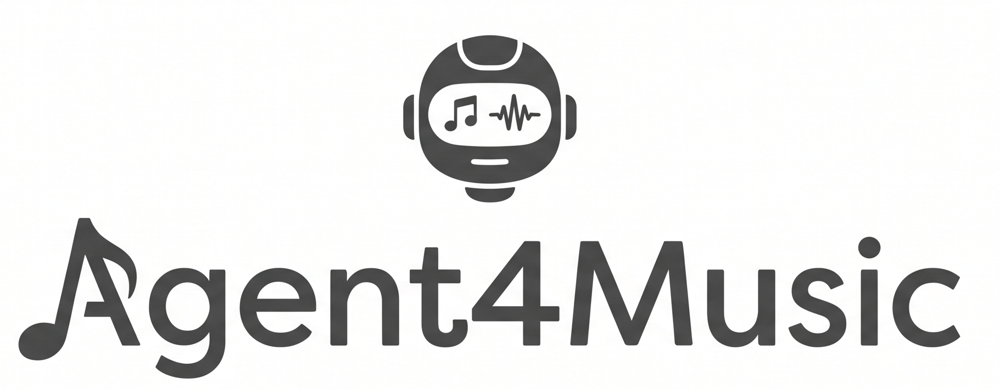

<div align="center">



**Agent4Music** — Intelligent Music Data Agent

An Agent System for Crawling, Analyzing & Visualizing Open Data of Modern Music Websites

[](https://python.org)
[](LICENSE)

**English** | [简体中文](docs/zh-CN/README.md)

</div>

---

## Table of Contents

- [Compliance Notice](#-compliance-notice-required-reading)
- [Highlights](#highlights)
- [Tech Stack](#tech-stack)
- [Quick Start](#quick-start)
- [Example Scripts](#example-scripts)
- [Supported Sites](#supported-sites)
- [Project Structure](#project-structure)
- [Adding a New Site](#adding-a-new-site)
- [Adding a New Skill](#adding-a-new-skill)
- [License](#license)

---

## ⚠️ Compliance Notice (Required Reading)

This project **only collects publicly accessible, non-copyright metadata** from music platforms (public charts, popular playlists, public artist profiles, lyric text, etc.).

- Does **not** bypass paid or DRM-protected content
- Does **not** download copyrighted audio files
- Does **not** perform aggressive high-frequency crawling
- Default request interval ≥ 1 second, with a built-in URL compliance blocklist

Please comply with each platform's Terms of Service and applicable laws. For learning and research purposes only.

---

## Highlights

- **Layered Agent architecture**: LLM decision-making + host execution + native tools + on-demand Skills
- **Latest charts**: One-click real-time fetch for QQ Music / NetEase charts (hot, new, rising, original, and more)
- **Preference-based recommendations**: Drag mood/scene tags and songs to match recommended playlists
- **Multi-site adapters**: QQ Music and NetEase Cloud Music public data (config-driven extension)
- **Skills system**: Data cleaning, lyric parsing, genre/tag classification
- **Sub-agent parallelism**: Independent per-site contexts for parallel collection
- **Full WebUI**: Task setup, live monitoring, data browsing, chart dashboard, export

## Tech Stack

| Layer | Technology |
|---|---|
| Backend | Python 3.10+, FastAPI, asyncio, SQLite |
| Agent | Custom 4-step handshake + multi-model LLM client |
| Crawler | httpx, Playwright |
| Frontend | Vue3, Vite, Element Plus, ECharts, TailwindCSS |
| Deployment | Docker, uvicorn |

## Quick Start

### 1. Clone the repository

```bash
git clone https://github.com/YOUR_USERNAME/Agent4Music.git
cd Agent4Music
```

### 2. Install dependencies

```bash
python3 -m venv venv
source venv/bin/activate   # Windows: venv\Scripts\activate
pip install -r requirements.txt
```

### 3. Configure LLM (optional)

```bash
export OPENAI_API_KEY=your_key
# Or use local Ollama: set provider to "ollama" in config/llm_config.json
```

### 4. One-click start

```bash
chmod +x start.sh
./start.sh
```

On startup you will see the ASCII banner and these endpoints:

| Entry | URL |
|------|-----|
| **WebUI** | http://127.0.0.1:8120/ |
| **API Docs** | http://127.0.0.1:8120/docs |

> **Note:** The WebUI requires a built frontend. If `webui/dist/` is missing, run `cd webui && npm install && npm run build` first, or let `start.sh` build it when Node.js is available.

### 5. WebUI development mode

```bash
# Terminal 1
uvicorn api.main_api:app --host 0.0.0.0 --port 8120

# Terminal 2
cd webui && npm install && npm run dev
# http://127.0.0.1:5173
```

### 6. Docker

```bash
docker compose up -d
```

## Example Scripts

```bash
python examples/skill_demo.py
python examples/single_site_demo.py qq
python examples/single_site_demo.py netease
python examples/batch_task_demo.py
```

## Supported Sites

| Site | ID | Supported types |
|------|-----|-----------------|
| QQ Music | `qq` | Charts, playlists, artists |
| NetEase Cloud Music | `netease` | Charts, playlists, artists |

## Project Structure

```
Agent4Music/
├── assets/              # Banner image & ASCII art
├── docs/zh-CN/          # Chinese README
├── scripts/             # show_banner.sh
├── core/                # Agent core
├── tools/               # Native toolset
├── skills/              # On-demand skills
├── services/            # Site adapters + database
├── api/                 # FastAPI endpoints
├── webui/               # Vue3 frontend
├── config/              # Global configuration
└── examples/            # Getting-started examples
```

## Adding a New Site

1. Add `config/spider_rules/{site}.json`
2. Implement `services/site_{site}.py` extending `BaseSiteAdapter`
3. Register the adapter in `services/factory.py`

## Adding a New Skill

1. Create `skills/{name}/SKILL.md`
2. Add handler logic in `skills/executor.py`

## License

MIT — see [LICENSE](LICENSE)
